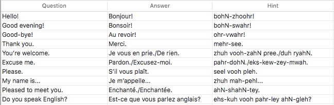
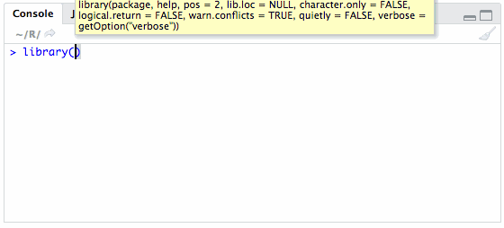
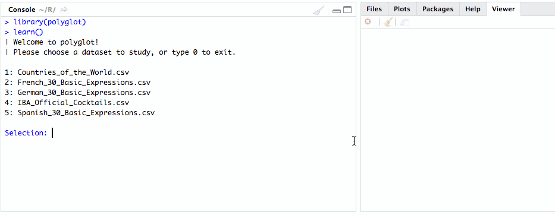
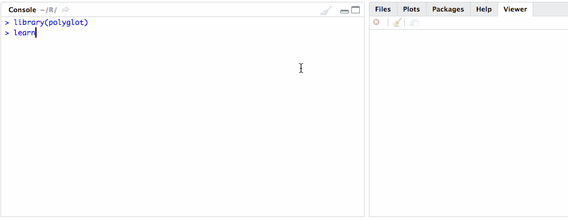

# polyglot 

The **polyglot** package helps you learn foreign language vocabulary or
any [flashcards](https://en.wikipedia.org/wiki/Flashcard) using R as an
interactive learning environment. The package implements the popular
[SuperMemo-2](https://en.wikipedia.org/wiki/SuperMemo) learning
algorithm which optimizes intervals between repetitions, minimizes the
time you spend on learning, and helps you achieve your learning goals in
the most effective
way.

### Installation

``` r
install.packages("polyglot") # or devtools::install_github("lgnbhl/polyglot")
# BEWARE that a new installation overwrites existing CSV files
```

### Minimal examples

Create a spreadsheet in a [CSV
format](https://en.wikipedia.org/wiki/Comma-separated_values) with a
`question` column, an `answer` column and an `hint/example` column
(optional).

For example, you could make a spreadsheet of 30 basic expressions in
French (the CSV file is already into the package).



The spreadsheet should be saved into the `extdata` directory of the
package.

To open the directory, simply run the `learn_dir()` function.

``` r
library(polyglot)

learn_dir()
```

To launch the learning environment, run the `learn()` function. Then
choose in the interactive menu the file you want to study.

``` r
learn() # to launch the interactive learning environment
```

The GIF below shows the learning of the CSV file
`French_30_Basic_Expressions.csv`.



### Learn with images

You can add images by putting the Web URL or the [full
path](https://en.wikipedia.org/wiki/Path_\(computing\)) of your images
into the spreadsheet rows.

For example, you can study the locations, flags and capitals of [all the
sovereign
states](https://en.wikipedia.org/wiki/List_of_sovereign_states) around
the world. Note that the images into the 3rd column `Hint` are displayed
into your Web browser.



You could also memorize the recipes of the [74 official
cocktails](https://en.wikipedia.org/wiki/List_of_IBA_official_cocktails)
of the International Bartenders Association (IBA).



The CSV files given as examples are
[here](https://github.com/lgnbhl/polyglot/tree/master/inst/extdata).

Happy learning\!
